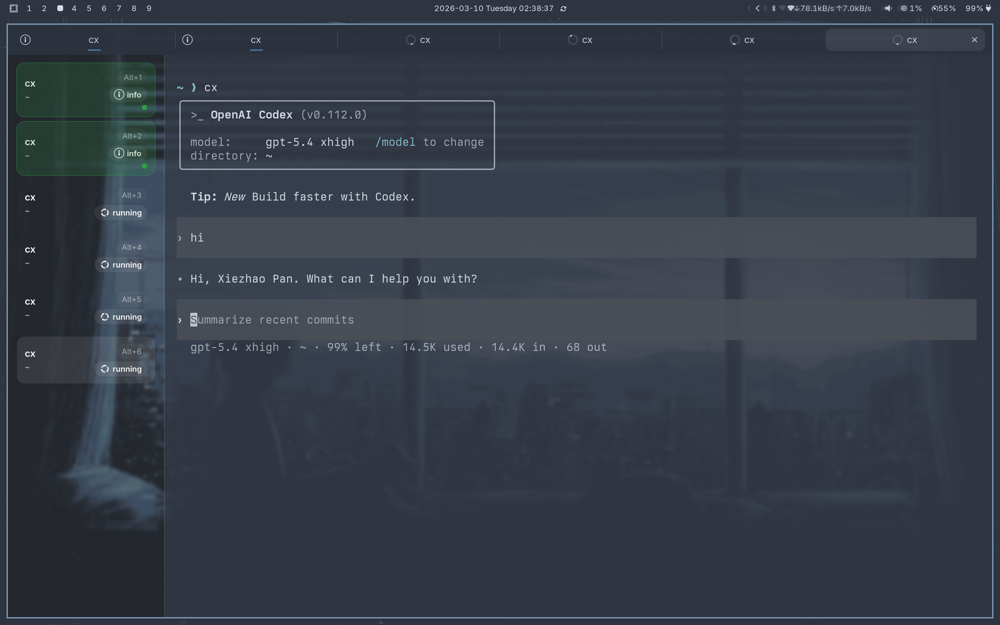

<p align="center">
  
</p>

<h1 align="center">panmux</h1>

<p align="center">
  <strong>🚀 为 coding agent 而生的终端</strong>
</p>

<p align="center">
  基于 Ghostty 的分叉，为 agent 密集型工作流添加真正需要的控制层
</p>

<p align="center">
  <a href="./README.md">English</a>
  ·
  <a href="./README.zh-CN.md"><strong>简体中文</strong></a>
</p>

<p align="center">
  
  
  
  
  
</p>

<p align="center">
  
</p>

---

## 💡 为什么做 panmux？

当你长期在终端里使用 **Codex** 或 **pi** 这样的 coding agent，最棘手的问题往往不是终端模拟本身，而是**协同管理**：

- 🤔 现在到底哪个 tab 在忙？
- ✅ 哪个会话已经结束了？
- 📁 这个 tab 对应哪个工作目录？
- 🔔 外部工具怎样在不靠屏幕解析的前提下传递状态？

**panmux** 就是为这些问题而生：在 Ghostty 已有的高性能终端基础之上，补上一层面向工作流的 UI 和轻量控制平面。

> **核心理念：** 保留 Ghostty 的快速终端内核，再补上 agent 密集型终端工作真正缺的那层控制。

---

## ✨ 核心特性

### 🎯 Agent 优先设计

从零开始为 coding agent 工作流打造：

- **📊 纵向侧边栏** — 一眼看清所有会话，不再藏在标签页里
- **📂 实时工作目录** — 清楚知道每个会话在哪里操作
- **⚡ 状态管理** — 外部工具可以把标签页标记为 `running`、`info`、`error` 或 `done`
- **🔔 智能通知** — 桌面通知自动映射回侧边栏状态

### ⌨️ 键盘驱动

- **Alt+1..9** — 快速切换标签页，快捷键可见
- **无需鼠标** — 从键盘完成整个工作流导航

### 🔌 强大的控制平面

- **Unix Socket API** — JSON-line 协议，方便外部工具集成
- **多实例隔离** — 每个窗口有独立的控制 socket
- **环境变量** — `PANMUX_INSTANCE_ID`、`PANMUX_SOCKET_PATH`、`PANMUX_TAB_ID`、`PANMUX_SURFACE_ID`
- **CLI 工具** — `panmuxctl` 用于脚本和自动化

### 🎨 现代技术栈

- **Zig + GTK4** — 原生性能 + 现代 UI
- **Ghostty 核心** — 业界领先的终端模拟
- **Wayland 原生** — Linux 桌面一等公民

---

## 🚀 快速开始

### 安装

```bash
# 克隆仓库
git clone https://github.com/yourusername/ghostty-panmux.git
cd ghostty-panmux

# 本地安装（开发阶段推荐）
./scripts/install_local_panmux.sh
```

这会安装到 `~/.local/opt/panmux/` 并创建：
- `~/.local/bin/panmux` — 主终端程序
- `~/.local/bin/panmuxctl` — 控制 CLI
- `~/.local/share/applications/panmux.desktop` — 桌面启动器

安装脚本还会把你当前 Ghostty 配置里与字体相关的设置快照到
`~/.local/opt/panmux/current/etc/xdg/ghostty/config.ghostty`，让 panmux
使用一份独立的已知稳定字体配置，而不是直接继承全局 Ghostty 配置。

### 基本使用

```bash
# 启动 panmux
panmux

# 在任意 tab 中，控制当前会话
panmuxctl notify --title "构建" --body "完成" --state done
panmuxctl set-status --state running --title "测试中"
panmuxctl clear-status

# 切换标签页
panmuxctl focus-tab --tab 2

# 列出所有标签页
panmuxctl list-tabs
```

---

## 🎮 与 Ghostty 的区别

panmux **不会** 替换 Ghostty 的渲染器、PTY 模型或终端引擎。

它只添加了一组聚焦的增强功能：

| 组件 | 改动 |
|------|------|
| **窗口外壳** | 重做 GTK 窗口，添加纵向侧边栏 |
| **标签页 UI** | 左侧边栏替代顶部标签栏 |
| **工作目录** | 侧边栏可见，来源于 Ghostty 的 pwd 信号 |
| **控制平面** | 每窗口 Unix socket + JSON-line 协议 |
| **环境变量** | 向 shell 子进程注入 `PANMUX_*` 变量 |
| **通知** | 桌面通知映射到标签页状态 |

**一句话总结：** Ghostty 继续负责终端本身，panmux 负责 agent 导向的窗口控制和状态 UX。

---

## 🔗 Codex 集成

panmux 与 Codex 集成**无需修改 Codex 源码**。

### 当前集成点

1. **通知桥接** — `scripts/panmux_codex_notify.py` 桥接 Codex 通知 payload
2. **Shell 检测** — 交互式 `codex` 命令自动标记标签页为 `running`
3. **Wrapper 兜底** — `scripts/panmux_codex_wrapper.sh` 用于显式状态更新
4. **OSC 9 信号** — Codex 完成信号通过 Ghostty 的通知路径映射到标签页状态

### 示例工作流

```bash
# 启动 Codex 时，标签页自动标记为 "running"
codex "实现用户认证"

# Codex 完成时，标签页显示 "done" 状态
# 如果你在另一个标签页，会看到注意力指示器
```

---

## 📋 当前状态

**已验证环境：** Arch Linux + Hyprland + Wayland

### ✅ 可用功能

- ✅ 纵向侧边栏导航
- ✅ 工作目录显示
- ✅ `Alt+1..9` 标签页切换
- ✅ `panmuxctl notify` / `set-status` / `clear-status`
- ✅ `panmuxctl focus-tab` / `list-tabs`
- ✅ 多实例隔离
- ✅ 环境变量注入
- ✅ 桌面通知映射

### 🚧 范围边界

**不打算做：**
- ❌ 完整复刻 `cmux`
- ❌ Electron/Tauri 包装层
- ❌ 基于 prompt 解析的 cwd 检测
- ❌ 通用 shell 生命周期跟踪

**当前不做的事情：**
- `pi` 集成（计划后续支持）
- 完整的会话恢复/持久化
- macOS 专属特性

---

## 📚 文档

- **[实现蓝图](./docs/IMPLEMENTATION_BLUEPRINT.md)** — 技术架构和设计决策
- **[补丁映射](./docs/PATCH_MAP.md)** — Fork 差异跟踪，用于上游同步
- **[Phase 0 探针报告](./docs/PHASE0_SPIKE_REPORT.md)** — 早期验证工作
- **[脚本](./scripts/)** — 本地安装和 Codex 集成辅助工具

---

## 🛠️ 开发

### 构建

```bash
zig build
```

macOS 快速构建（如果不需要 app bundle）：
```bash
zig build -Demit-macos-app=false
```

### 测试

```bash
# 运行所有测试（较慢）
zig build test

# 运行特定测试
zig build test -Dtest-filter=<测试名称>
```

### 格式化

```bash
# Zig 代码
zig fmt .

# Swift 代码（macOS）
swiftlint lint --fix

# 其他文件
prettier -w .
```

---

## 🤝 贡献

这是一个活跃的原型项目。欢迎贡献，但请注意：

- **暂不接受 issue 和 PR** — 项目处于快速迭代阶段
- **专注 Linux/GTK** — macOS 支持继承自 Ghostty，但不是主要关注点
- **Agent 工作流优先** — 功能应服务于 coding agent 使用场景

---

## 🔄 上游同步

本仓库跟踪 Ghostty 作为上游：

```bash
# 推荐的远端设置
git remote add origin <你的-panmux-fork>
git remote add upstream https://github.com/ghostty-org/ghostty
```

我们维护最小的 fork 差异，专注于：
- GTK 窗口外壳修改
- 侧边栏 UI 组件
- 控制平面集成
- 环境变量注入

---

## 📄 许可证

MIT License - 详见 [LICENSE](./LICENSE)

基于 Mitchell Hashimoto 及贡献者的 [Ghostty](https://github.com/ghostty-org/ghostty)

---

## 🙏 致谢

- **[Ghostty](https://github.com/ghostty-org/ghostty)** — 让这一切成为可能的出色终端模拟器
- **[cmux](https://github.com/manaflow-ai/cmux)** — Agent 导向终端 UI 的灵感来源
- **[Codex](https://codex.so)** — 驱动我们构建更好终端协同工具的 coding agent

---

<p align="center">
  <strong>用 ❤️ 为终端开发者打造</strong>
</p>
